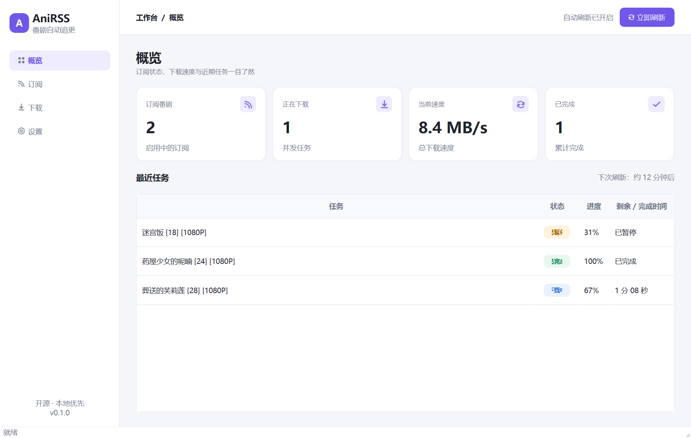
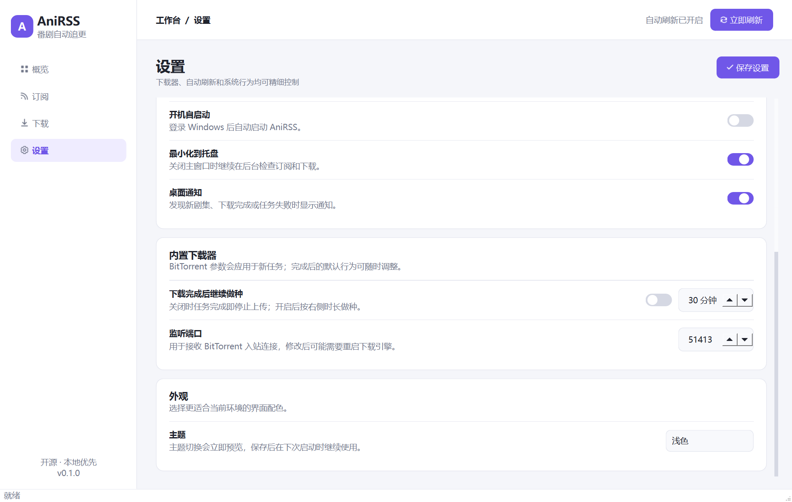

# AniRSS

AniRSS 是一个开源的桌面 RSS/Atom 订阅与下载管理器，面向按集更新的合法媒体。它会定时读取
用户添加的订阅源，按每部番剧的规则识别新条目，把 HTTP 文件、种子文件或磁力链接交给内置
下载器，并保存到对应的番剧文件夹。

> **版权与使用声明**：AniRSS 只是通用订阅和下载工具。你只能订阅、下载和分享自己有权访问的
> 内容，并应遵守内容许可、服务条款和当地法律。AniRSS 不提供内容源、不绕过 DRM/付费墙，也
> 不鼓励侵权。BT 上传（做种）可能构成再分发；请只在内容许可和网络政策允许时使用。

当前版本为 `0.1.5`，仍处于早期阶段。数据库结构、设置格式和界面可能在后续 `0.x` 版本中调整；
重要媒体和应用数据请自行备份。

**支持平台：Windows 10/11 x64。** AniRSS 不支持 Linux、macOS 或 32 位 Windows。

## 0.1 已实现

- **按番剧归档**：每个订阅有独立名称、RSS 地址、过滤规则和保存位置。保存位置留空时，AniRSS
  会在全局下载目录下创建经过安全化处理的番剧子文件夹。
- **订阅文件夹**：可以创建带独立下载根目录的逻辑文件夹，并在文件夹或“未分类”之间移动订阅；
  移动只改变未来任务的默认目录，不会移动或删除已有文件。
- **RSS/Atom 自动刷新**：支持定时轮询和“立即刷新”，使用订阅内的 GUID 或下载链接去重。
- **基础匹配规则**：支持“必须包含”关键词、“排除关键词”和用于提取集数的自定义正则。
- **安全的首次刷新**：新订阅默认在第一次成功刷新时只建立基线，不下载源中已经存在的条目。
  只有显式打开“首次同步”中的“首次刷新时也下载订阅中已有的条目”，并同时启用自动下载，
  首次刷新才会把既有匹配项入队。若应用在首次基线写入途中退出，只要成功时间尚未提交，
  下次刷新仍会按首次基线处理剩余条目，不会把它们误判为新更新。
- **内置下载器**：HTTP/HTTPS 下载器随基础安装提供；种子和磁力链接由可选的 `libtorrent`
  Python 绑定处理，不需要启动外部下载器进程。
- **下载任务管理**：界面显示队列、进度、速度和错误，可暂停、继续、移除任务或打开保存目录。
- **订阅内容与自主下载**：点击订阅可查看已记录的具体条目、发布时间、下载类型、规则匹配和任务
  状态；即使关闭自动下载或条目未匹配规则，也可明确选择单条内容加入下载，不会批量补下历史。
- **桌面集成**：提供浅色/深色/跟随系统主题、系统托盘、桌面通知和当前用户级开机自启动。
- **响应式桌面界面**：适配紧凑窗口和 Windows 高 DPI 显示缩放，长标题和路径不会挤压其他控件；
  页面与详情过渡可中断，并遵循系统“关闭动画效果”偏好。
- **稳定滚动位置**：定时刷新、保存设置和任务状态更新会保留当前页面的纵向滚动位置。
- **单实例保护**：正式模式下，同一应用数据目录同时只允许一个 AniRSS 桌面进程使用，避免两个
  窗口并发写入同一个 SQLite 数据库；不同 `--data-dir` 在锁和数据库层面彼此独立。
- **本地持久化**：订阅、已见条目、下载任务和设置保存在本机 SQLite 数据库；运行日志也只写入
  本机应用数据目录。AniRSS 不包含云账户、遥测或内置内容源。

## 界面预览





## 安装

### 从源码运行

需要 Python 3.11 或更高版本。推荐使用虚拟环境：

```powershell
# 下载或克隆本仓库后进入项目目录
cd AniRSS
python -m venv .venv
.\.venv\Scripts\Activate.ps1
python -m pip install -U pip
python -m pip install -e .
anirss
```

也可以运行 `python -m anirss`；`anirss-gui` 入口不会额外打开控制台窗口。

基础安装包含 PySide6 界面和 HTTP 下载器。若要处理种子文件或磁力链接，可安装可选依赖：

```text
python -m pip install -e ".[torrent]"
```

`libtorrent` 包含原生代码，可用性取决于 Python 版本、操作系统和 CPU 架构。安装失败时 AniRSS
仍可作为 HTTP 下载器使用。请优先从 PyPI、系统发行版、conda-forge 或项目正式发布渠道取得
兼容构建，不要从未知站点下载二进制文件。

### 打包桌面应用

项目提供 PyInstaller 配置：

```powershell
python -m pip install -e ".[packaging]"
.\scripts\build.ps1 -Clean
```

构建含 BT 支持的产物可使用 `-WithTorrent`。PyInstaller 通过仓库中的独立启动器导入正式应用
入口，保持源码包的相对导入语义；更多说明见[打包文档](docs/packaging.md)。

未传入签名证书时，Windows 脚本只生成本地开发包并显示警告。正式 Windows 发行必须使用
`-RequireSignature` 和可信 Authenticode 证书；签名失败时构建会终止。不要通过杀毒排除项分发
未验证的 EXE，疑似误报应提交微软样本分析并等待最终判定。

## 快速开始

1. 打开“设置”，确认默认下载目录，并按需调整并发下载数、RSS 轮询间隔和桌面行为。
2. 打开“订阅”，点击“新增订阅”，填写番剧名称和 HTTP/HTTPS RSS 地址。
3. “保存目录”可以留空；此时会在默认下载目录下自动创建番剧文件夹。也可以通过“浏览”选择
   该订阅专用的绝对目录。
4. 按需填写必须包含、排除关键词和集数正则。开启“自动下载”后，新匹配条目才会建立下载任务。
5. 保持“首次同步”中的“首次刷新时也下载订阅中已有的条目”关闭可安全建立基线；只有确实要
   下载订阅源当前列出的旧条目时才打开它。
6. 保存后点击番剧名称进入订阅详情，可用“刷新此订阅”立即读取内容，并搜索或筛选已记录条目。
7. 对带有 HTTP、种子或磁力下载地址的条目，可点击“下载”自主加入队列；已有任务可跳转到
   “下载”页查看、暂停、继续、移除或打开文件夹。

关闭“自动下载”不会生成待确认候选，也不会因为以后重新开启而自动补入队列；但已记录条目会
保留在该订阅的详情页，用户可以逐条明确选择下载。自主下载会绕过该订阅的自动开关和关键词
过滤，但仍使用安全目录、文件名去重和单条任务唯一约束。

## 匹配与首次刷新

- “必须包含”中的多个词都必须出现在条目标题中，不区分大小写。
- “排除关键词”命中任意一个词时忽略该条目。
- “集数正则”用于从标题中提取集数信息；它不是单独的下载开关。
- AniRSS 优先识别磁力链接和明确的 RSS/Atom enclosure，也能识别条目中出现的 `.torrent` 链接。
  普通文章页链接不会被当作媒体文件下载。
- 去重范围在单个订阅内：优先使用 GUID，同时也避免重复处理相同的下载链接。
- 首次成功刷新默认只把当时看到的条目写入本地基线。随后新增的匹配条目才会自动下载。

0.1 不提供保存前的订阅源“测试”、规则试运行或 OPML 导入/导出。刷新后可在订阅详情中查看每条
内容是否匹配现有规则，并按需手动下载。建议仍保持“首次刷新时也下载订阅中已有的条目”关闭，
先建立安全基线再决定具体条目。

## 下载行为

### HTTP/HTTPS

HTTP 下载先写入同目录的 `.part` 文件，成功后再替换为最终文件。任务中断后，下一次继续会在存在
部分文件时发送 `Range` 请求。只有服务器返回 `206`，且 `Content-Range` 的起点正好等于本地
`.part` 大小、范围与总长度自洽时才会追加；服务器忽略 Range 并返回完整响应时会从头重写，
范围不一致则保留部分文件并报错。当前实现没有基于 ETag 的文件身份校验，也没有自动 HTTP 重试。

设置中的代理只用于 RSS 获取和 HTTP 请求，包括 `.torrent` 元数据的 HTTP 获取。请使用普通
HTTP 代理地址，例如 `http://127.0.0.1:7890`。该选项不会代理 libtorrent 的 Tracker、DHT、PEX
或对等连接，也不提供 SOCKS/BT 代理配置。

### BT/磁力链接

BT 支持需要可选的 `libtorrent`。默认不在下载完成后继续做种；如果打开“下载完成后继续做种”，
可按分钟设置做种时长。0.1 不支持按分享率停止。

“下载完成后不继续做种”只描述完成后的行为。BT 协议在下载阶段仍可能向其他节点上传数据，无法
通过这个开关保证零上传。若内容许可禁止再分发，请不要使用 BT，改用获授权的 HTTP 下载方式。

## 设置

0.1 设置页仅包含以下项目：

- 默认下载目录、并发下载数、RSS 轮询间隔和 HTTP 代理；
- 当前用户级开机自启动、最小化到托盘和桌面通知；
- 下载完成后是否继续做种、做种分钟数、BT 监听端口和无资源超时；
- 浅色、深色或跟随系统主题。

字段范围和生效时机见[配置说明](docs/configuration.md)。

## 数据与隐私

应用数据默认位于 Windows 当前用户数据目录：`%LOCALAPPDATA%\AniRSS`。

其中 `anirss.db` 是 SQLite 数据库，`logs/anirss.log` 是轮转日志，`anirss.instance.lock` 用于阻止
同一数据目录被两个桌面进程同时打开。数据库会保存完整订阅地址、下载链接和代理设置，且不进行
应用层加密；带 Token、passkey 或代理凭据的地址应视为敏感数据。不要把数据库或日志直接提交到
Git 或公开 issue，分享前请自行检查并清理。

AniRSS 不需要管理员权限。开机自启动只写入当前用户注册表。请不要把下载目录设为系统目录，
也不要以管理员身份运行。

## 0.1 已知限制

- 仅支持 Windows 10/11 x64，不支持 Linux、macOS 或 32 位 Windows。
- 不支持 OPML 导入/导出、保存前订阅测试或独立的人工确认候选队列。
- RSS 请求没有 ETag/Last-Modified 条件请求、自动重试、随机抖动或错误指数退避。
- HTTP 下载没有自动重试；界面没有 HTTP 限速、重试次数或重定向策略设置。
- BT 没有分享率停止条件，也没有 BT/SOCKS 代理设置；代理字段只覆盖 RSS/HTTP。
- 不提供远程 Web 控制、远程诊断导出、多用户权限、云同步、内容搜索或 DRM 解密。
- 不自动执行、挂载、解压或安装下载到的文件。

详细组件边界见[架构说明](docs/architecture.md)。发现安全问题请按 [SECURITY.md](SECURITY.md)
私下报告；普通错误与贡献流程见 [CONTRIBUTING.md](CONTRIBUTING.md)。

## 开发

```powershell
python -m pip install -e ".[dev]"
ruff check .
ruff format --check .
pytest
mypy
```

基础测试不要求访问公网；缺少 libtorrent 时，BT 相关能力应当可以跳过而不影响 HTTP 功能。

## 许可证

AniRSS 以 [MIT License](LICENSE) 发布。MIT 许可证只适用于本项目代码，不会赋予你对订阅内容、
下载媒体、字体、图标或第三方组件的额外权利。发布安装包时还需遵守 Qt、libtorrent 和其他依赖
各自的许可证与声明要求。
